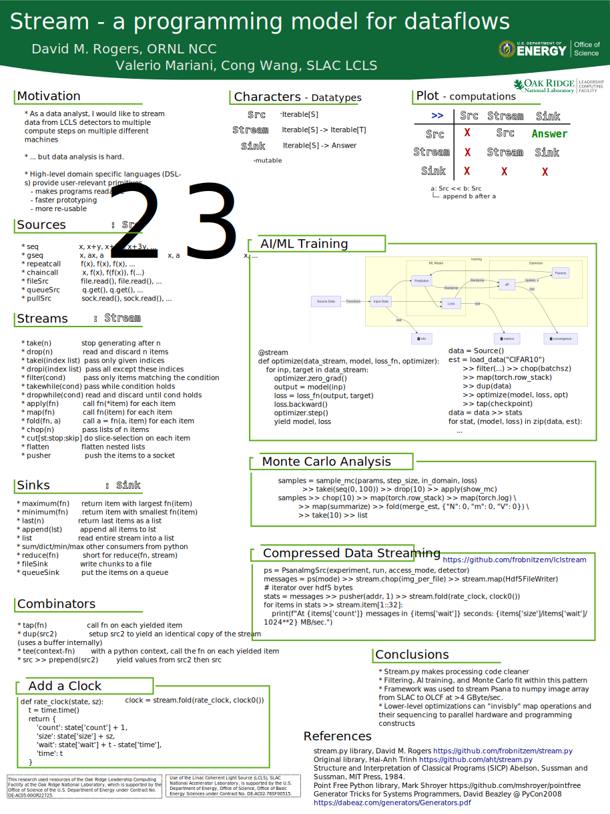

ABOUT
=====

`streams` gives you types for iterable `Source`-s, iterable-to-iterable
transformations (`Stream`-s), and iterable consumers (`Sink`-s).
These enable data-flow programming, easy parallelization,
and network operations.

See the reference documentation in [doc](doc/index.rst).

INSTALL
=======

This module requires Python 3.6.

    $ pip install stream

or, for development,

    $ pip install -e .

TEST
====
    
    pytest --doctest-modules stream # run doctests
    pytest test/*.py # runs test_* functions

RELEASES
========

See the [changelog](CHANGELOG.md) for a description of new features
in each release.  Basically, 0.8 is suitable for python2, and 0.9
and beyond are for python3.

The 1.0 version introduces important semantic changes to distinguish
Source/Stream/Sink types.

ROADMAP
=======

1.1: Less annoying type errors for library consumers.

1.2: Improved handling of parallel functions.
     - ThreadStream/ProcessStream make use of QueueSource/QueueSink.

1.3: Exception handling for stream.parallel functions.

1.4: stream.parallel.PipeSink / PipeSource pairs will read ACK-s from the receiver to guard against sending too much data to a slow receiver

1.5: exchange data between stream.parallel processes using shared memory

2.0: Add typing.Concatenate and typing.ParamSpec to BaseStream.pipe (>>)
     
